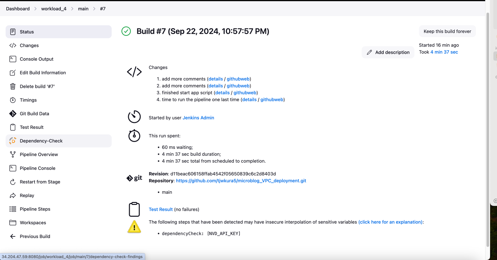
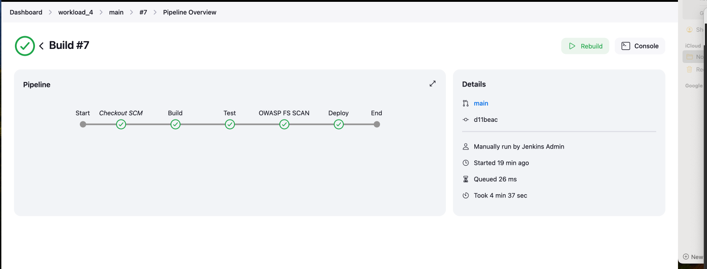
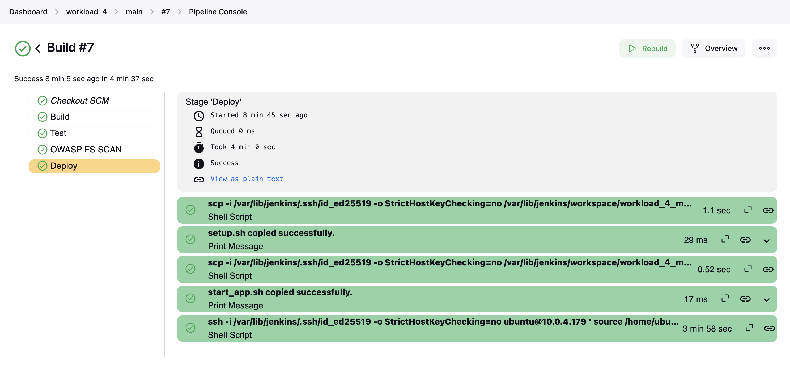
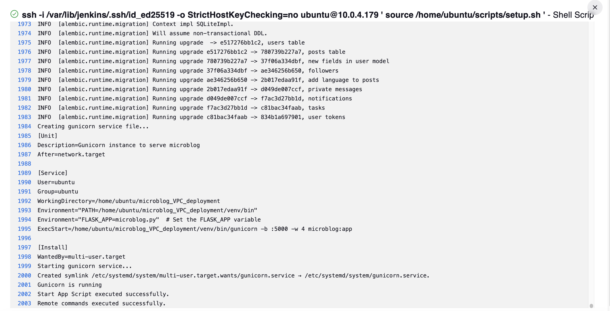
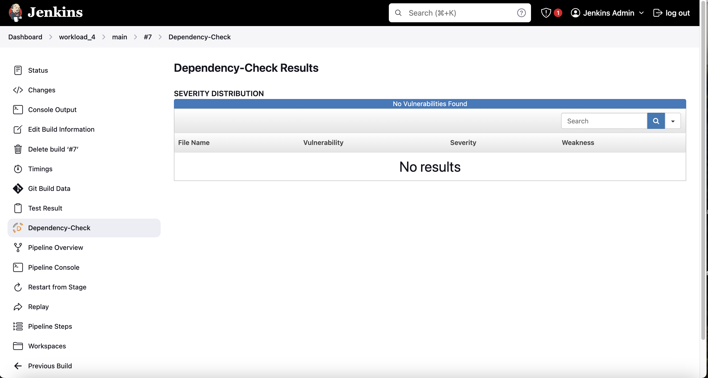
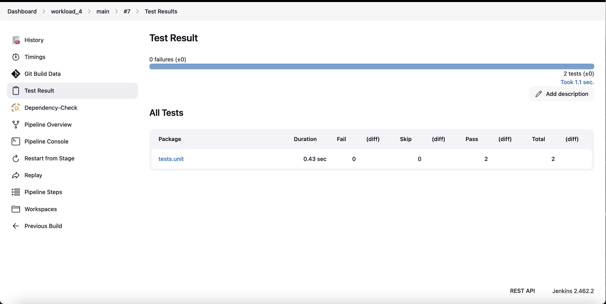
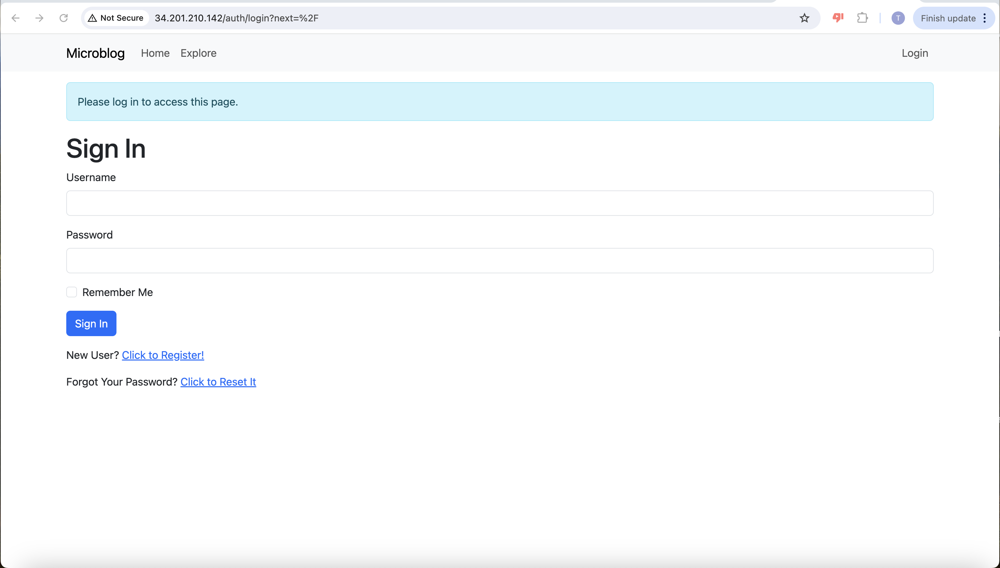
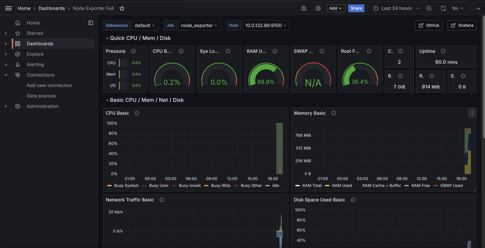
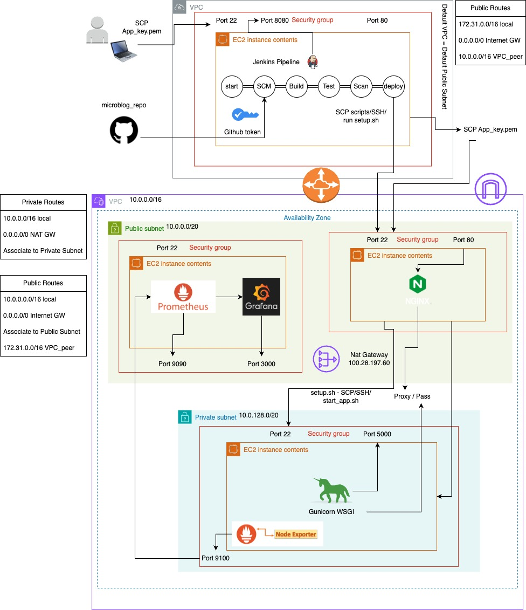

# Microblog Deployed to EC2 on Custom VPC

---


## Purpose

In our previous workload, we were introduced to provisioning our own infrastructure, but it was far from an optimal system. In this workload, we will address some of the issues from workload 3. Specifically, we will create a custom VPC and separate EC2 instances for our Jenkins server, web server (running Nginx), application server (running our Flask app), and a monitoring server. Additionally, we will set up public and private subnets to separate our application into tiers.

Let's get started!

## Clone Repository

Clone [this](https://github.com/kura-labs-org/C5-Deployment-Workload-4) github repository to your Github account. The steps for this have been outlined in the past two workloads. If you get stuck you can refer back to workload 2 [here](https://github.com/tjwkura5/retail-banking-app-deployed-elastic-beanstalk-2).

## Custom VPC
In this section we will go over the steps for creating a custom VPC. Our VPC will have a one availability zone (AZ), a public and private subnet and a NAT Gateway.

**Step 1: Create a Custom VPC**

1. Navigate to the VPC Dashboard:

    *  In the AWS Console, search for "VPC" and click on "VPC" under "Networking & Content Delivery".
Click on "Create VPC":

2. In the VPC dashboard, click the "Create VPC" button.

3. VPC Settings:

    * Name tag: Enter a name for your VPC (e.g., MyCustomVPC).
    * IPv4 CIDR block: Enter an IP range (e.g., 10.0.0.0/16).
    * IPv6 CIDR block: Leave this empty unless you need IPv6.
    * Tenancy: Choose "Default" u
    * Enable DNS hostnames: Select "Yes" (ensures EC2 instances get public DNS names).
    * Enable DNS resolution: Select "Yes" (enables resolving domain names).

4. Click "Create VPC".

**Step 2: Create Subnets**

1. Create a Public Subnet:

    * On the VPC Dashboard, go to "Subnets" and click on "Create subnet".
    * Name tag: Enter a name (e.g., PublicSubnet).
    * VPC ID: Choose the VPC you just created (e.g., MyCustomVPC).
    * Availability Zone: Select one Availability Zone (e.g., us-east-1a).
    * IPv4 CIDR block: Enter a subnet IP range (e.g., 10.0.1.0/24 for the public subnet).
    * Enable auto-assign public IPv4 address: Check this box (this ensures that EC2 instances in this subnet get a public IPv4 address automatically).
    * Click "Create subnet".

2. Create a Private Subnet:

    * Repeat the steps to create a second subnet for the private subnet.
    * Name tag: Enter a name (e.g., PrivateSubnet).
    * VPC ID: Choose the same VPC.
    * Availability Zone: Select the same Availability Zone (e.g., us-east-1a).
    * IPv4 CIDR block: Enter a different subnet IP range (e.g., 10.0.2.0/24 for the private subnet).
    * Click "Create subnet".

**Step 3: Create and Attach an Internet Gateway (for Public Subnet)**

1. Create Internet Gateway:
    * In the VPC Dashboard, go to "Internet Gateways" and click on "Create internet gateway".
    * Name tag: Enter a name (e.g., MyInternetGateway).
    *  Click "Create internet gateway".
2. Attach Internet Gateway to VPC:
    * After creating the internet gateway, select it and click "Actions" → "Attach to VPC".
    * Choose the VPC you created (e.g., MyCustomVPC).

**Step 4: Modify Route Table for Public Subnet**

1. Create a Route Table:
    * In the VPC Dashboard, go to "Route Tables" and click "Create route table".
    * Name tag: Enter a name (e.g., PublicRouteTable).
    * VPC: Choose your VPC.
    * Click "Create route table".
2. Add a Route to the Internet:
    * Select the public route table you just created.
    * Under the "Routes" tab, click "Edit routes" → "Add route".
    * Destination: 0.0.0.0/0 (for all IPv4 traffic).
    * Target: Select "Internet Gateway" and choose the one you created (e.g., MyInternetGateway).
    * Click "Save routes".
3. Associate Public Subnet with Route Table:
    * Under the "Subnet associations" tab of the route table, click "Edit subnet associations".
    * Select the public subnet you created earlier (e.g., PublicSubnet) and click "Save".

**Step 5: Create a NAT Gateway (for Private Subnet)**

1. Create an Elastic IP (EIP):

    *  In the VPC Dashboard, go to "Elastic IPs" and click "Allocate Elastic IP address".
    * Click "Allocate" to get a new EIP.

2. Create NAT Gateway:
    * In the VPC Dashboard, go to "NAT Gateways" and click "Create NAT Gateway".
    * Subnet: Select the public subnet (PublicSubnet).
    * Elastic IP Allocation ID: Select the Elastic IP address you just created.
    * Click "Create NAT Gateway".

3. Modify Route Table for Private Subnet:
    * In the VPC Dashboard, go to "Route Tables" and select the private route table.
    * Under "Routes", click "Edit routes" → "Add route".
    * Destination: 0.0.0.0/0.
    * Target: Select "NAT Gateway" and choose the one you created.
    * Click "Save routes".

## Jenkins Server

**Setting Up the CI Server (Jenkins):**

In the Default VPC, create an Ubuntu EC2 instance (t3.micro) named "Jenkins". Be sure to configure the security group to allow for SSH and HTTP traffic in addition to the ports required for Jenkins and any other services needed (Security Groups can always be modified afterward). We have gone over this step in the past two workloads so it should be familar if you need a refresher you can take a look at the instructions [here](https://github.com/kura-labs-org/AWS-EC2-Quick-Start-Guide/blob/main/AWS%20EC2%20Quick%20Start%20Guide.pdf).

We will use the Jenkins installation script we created in workload 3 to install Jenkins. We will keep our Jenkinsfile mostly the same as in the previous workload, except for the OWASP FS SCAN stage, and we will leave the deploy stage blank for now.

**The OWASP FS SCAN Stage**

In the last workload, we signed up for and created an NVD API key to speed up our dependency check stage. We were adding the nvd_api_key directly to the pipeline script, which is a security risk. This time, we will add our nvd_api_key to Jenkins using the Manage Credentials feature. 

**Step 1: Access Jenkins Dashboard**
1. Login to Jenkins:
    * Open Jenkins in your web browser and log in using your credentials.
2. Navigate to the Jenkins Dashboard.

**Step 2: Access Manage Jenkins**
1. From the Jenkins Dashboard, click on "Manage Jenkins" in the left-hand menu.
2. Scroll down to the "Security" section and click on "Manage Credentials".

**Step 3: Select Credentials Domain**
1. On the Manage Credentials page, select the (global) domain under "Stores scoped to Jenkins". If you want to scope the credential to a specific domain or folder, select the appropriate one.
2. In the (global) domain, click on "Add Credentials" on the left side.

**Step 4: Add NVD_API_KEY**
1. In the Kind dropdown, select "Secret text" (since the nvd_api_key is a secret value).
2. Secret: Enter your nvd_api_key in the text box.
3. ID: (Optional) You can provide a specific ID for easier reference in pipelines (e.g., nvd_api_key). If left empty, Jenkins will auto-generate one.
4. Description: Provide a description (e.g., "NVD API Key for OWASP Scans").
5. Click "OK" to save the credentials.

**Step 5: Using NVD_API_KEY in a Jenkins Pipeline**
1. Open your Jenkinsfile.
2. In the OWASP FS SCAN stage, you can reference the API key like this:

    ```
        stage('OWASP FS SCAN') {
            steps {
                // Use the withCredentials step to inject the NVD API key into the environment
                withCredentials([string(credentialsId: 'NVD_API_KEY', variable: 'NVD_API_KEY')]) {
                    dependencyCheck additionalArguments: "--scan ./ --disableYarnAudit --disableNodeAudit --nvdApiKey ${NVD_API_KEY}", 
                                   odcInstallation: 'DP-Check'
                    dependencyCheckPublisher pattern: '**/dependency-check-report.xml'
                }
            }
        }
    ```

## Create our App and Web Server

1. Create an EC2 t3.micro called "Web_Server" In the PUBLIC SUBNET of the Custom VPC, and create a security group with ports 22 and 80 open.

2. Create an EC2 t3.micro called "Application_Server" in the PRIVATE SUBNET of the Custom VPC, and create a security group with ports 22 and 5000 open. Make sure you create a new key pair and save it to your local machine.

3. SSH into the "Jenkins" server and run ssh-keygen. Copy the public key that was created and append it into the "authorized_keys" file in the Web Server.

4. Test the connection by SSH'ing into the 'Web_Server' from the 'Jenkins' server. This will also add the web server instance to the "list of known hosts". A known host refers to a remote server that you have previously connected to.

5. In the Web Server, install NginX. We did this in workload 3 you can take a look [here](https://github.com/tjwkura5/microblog_VPC_deployment/tree/main).

6. Modify the "sites-enabled/default" file so that the "location" section reads as below:

    ```
    location / {
        proxy_pass http://<app_server_private_IP>:5000;
        proxy_set_header Host $host;
        proxy_set_header X-Forwarded-For $proxy_add_x_forwarded_for;
    }
    ```

## VPC Peering

In the "Create our App and Web Server" section, we are testing the connection between our Jenkins and web server by SSH'ing into the 'Web_Server' from the 'Jenkins' server. However, we are using public IP addresses to do so. The issue with using public IP addresses is that they can change. In this section, we will set up VPC peering. VPC peering allows you to connect two Virtual Private Clouds (VPCs) so that they can communicate with each other privately using private IP addresses.

**Initiate VPC Peering Request**
1. Open the VPC Dashboard:
    * Navigate to VPC by searching for it in the services search bar.
2. Create the Peering Connection:
    * In the VPC Dashboard, on the left panel, choose Peering Connections under VPC.
    * Click Create Peering Connection.
3. Configure the Peering Connection:
    * Give the peering connection a name.
    * Select the Requester VPC (default VPC).
    * Select the Accepter VPC:
        * Select the second VPC from the dropdown.
4. Choose Peering Connection Type:
    * Select intra-region (same region).
5. Create Peering Request:
    * After filling out the details, click Create Peering Connection.
    * A request will be initiated to the Accepter VPC (in the same or a different account).

**Accept the VPC Peering Request**
1. Accept the Request:
    * Go to the VPC Dashboard
    * In the Peering Connections section, select the pending peering connection.
    * Click Actions and then Accept Request.
2. Verify the Peering Connection:
    * After acceptance, the peering connection status should change to Active.

**Modify the Route Tables for Both VPCs**
1. Update Route Tables:
    * In both the Requester and Accepter VPCs, you’ll need to modify the route tables so that instances in one VPC can communicate with the other.
2. For the Requester VPC:
    * Go to Route Tables in the VPC Dashboard.
    * Select the route table for the VPC subnet(s) that need access to the Accepter VPC.
    * Under Routes, click Edit Routes, then click Add Route.
    * In the Destination field, enter the CIDR block of the Accepter VPC.
    * In the Target field, select the Peering Connection you created.
    * Click Save routes.
3. For the Accepter VPC:
    * Repeat the same process, but this time modify the route table in the Accepter VPC and add a route to the Requester VPC’s CIDR block.

**Test the Peering Connection**

Once the routing is in place, test the connection by trying to communicate between instances in the two VPCs.

* SSH into the 'Web_Server' from the 'Jenkins' server using the web server private IP addres.

## Copy The Key Pair

In this section we will be copying the key pair (.pem file) that we created for our Application_Server to our Web_server.

1. Run the 'ssh-keygen' command on your local machine to generate both public and private keys. You should see something like the following:

    ```
    Your identification has been saved in /Users/terrywoolard/.ssh/id_ed25519
    Your public key has been saved in /Users/terrywoolard/.ssh/id_ed25519.pub
    ```
2. Copy the public key (id_ed25519.pub) and add it the authorized keys file on the remote server. The path to the authorized keys files should be the following:

    ```
    ~/.ssh/authorized_keys 
    ```
3. Test your connection by SSH'ing into the remote server:
    ```
    'ssh -i /path/to/private_key remote_username@publicip' 
    ```
4. Copy the .pem file from your local machine to your remote machine:
    ```
    scp -i /Users/terrywoolard/.ssh/id_ed25519 /Users/terrywoolard/Desktop/app-key.pem ubuntu@54.83.57.1:/home/ubuntu/.ssh
    ```
5. Now you should be able to SSH from your Web_Server to your Application_Server by running the following:

    ```
    ssh -i /home/ubuntu/.ssh/app-key.pem ubuntu@10.0.132.86
    ```
6. You might see the following error message after SSH'ing

    ```
    @@@@@@@@@@@@@@@@@@@@@@@@@@@@@@@@@@@@@@@@@@@@@@@@@@@@@@@@@@@
    @         WARNING: UNPROTECTED PRIVATE KEY FILE!          @
    @@@@@@@@@@@@@@@@@@@@@@@@@@@@@@@@@@@@@@@@@@@@@@@@@@@@@@@@@@@
    Permissions 0644 for '/home/ubuntu/.ssh/app-key.pem' are too open.
    It is required that your private key files are NOT accessible by others.
    This private key will be ignored.
    Load key "/home/ubuntu/.ssh/app-key.pem": bad permissions
    ubuntu@44.198.163.154: Permission denied (publickey).
    ```

    To fix the preceding error you need to change the permissions of the file so that only the owner has read, write or executable permissions. I gave the owner read and write permissions.

    ```
    chmod 600 /home/ubuntu/.ssh/app-key.pem
    ```

## Our Scripts

In this section we will be creating two scripts:

1. start_app.sh: This script will run on the application server to set up the server with all the necessary dependencies for the application. It will clone the GitHub repository, install the application dependencies from the requirements.txt file, as well as additional packages such as gunicorn, pymysql, and cryptography. The script will also set environment variables, run Flask commands, and finally execute the gunicorn command to serve the application in the background.

2. setup.sh: This script will run on the Web Server and SSH into the Application Server to execute the start_app.sh script.

We will be sure to run these scripts with "source" to avoid issues. The main difference between running a script with source and running it by using bash or making it executable is how they affect the current shell environment:

* source script.sh: Executes the script within the current shell. Any changes (like environment variables or directory changes) stay in the current session.

* bash script.sh or ./script.sh: Executes the script in a new shell (child process). Changes made by the script do not affect the current shell.

**Setup Script**

1. Defining Variables
    ```
    FILE_PATH="/home/ubuntu/scripts/start_app.sh"
    REMOTE_IP="10.0.132.86"
    SSH_KEY="/home/ubuntu/.ssh/app-key.pem"
    ```
2. Copying the Script to the Remote Server

    ```
    scp -i "${SSH_KEY}" -o StrictHostKeyChecking=no "${FILE_PATH}" ubuntu@"${REMOTE_IP}":"${FILE_PATH}"
    ```

    * -o StrictHostKeyChecking=no: Disables the prompt to verify the identity of the remote server.
3. Checking the Success of the File Transfer
    ```
    if [ $? -eq 0 ]; then
        echo "File copied successfully."
    else
        echo "Failed to copy the file."
        exit 1
    fi
    ```

    * $?: This variable holds the exit status of the last command (scp). If it’s 0, the command was successful; if it’s non-zero, it failed.

4. Connecting to the Remote Server via SSH and Running Commands
    ```
    ssh -i "${SSH_KEY}" -o StrictHostKeyChecking=no ubuntu@"${REMOTE_IP}" << 'EOF'
    ```

    * The << 'EOF' is a here document. Everything between << 'EOF' and EOF is passed as a set of commands to be executed on the remote server.

5. Checking SSH Connection
    ```
    if [ $? -ne 0 ]; then
        echo "Failed to connect to the remote server."
        exit 1
    fi
        echo "Connected to the remote server."
    ```
6. Printing the IP Address of the Remote Server
    ```
    echo "The IP address of this server is: $(hostname -I | awk '{print $1}')"
    ```
7. Running the Start App Script on the Remote Server
    ```
    source /home/ubuntu/scripts/start_app.sh
    ```
Within the here document we will have a check to see whether or not the start_app.sh script ran successfully on the remote server by checking its exist status. Once all the SSH commands finish we will have a check for the overall success of the SSH session. Then finally we will exit our script with a status of zero. Check out the final version of our set up script located in the scripts directory. 

**Start App Script**

1. Update and Upgrade System Packages
    ```
    echo "Updating and upgrading system packages..."
    sudo apt update && sudo apt upgrade -y
    ```
2. Install Python 3.9, venv, pip and other packages needed for python
    ```
    sudo apt install python3.9 python3.9-venv -y
    sudo add-apt-repository ppa:deadsnakes/ppa
    sudo apt install python3-pip
    sudo apt install software-properties-common
    ```
3. Install additional development tools
    ```
    echo "Installing build tools for Python package compilation..."
    sudo apt install build-essential libssl-dev libffi-dev -y
    ```

    * Purpose: Installs essential tools for compiling software from source, including:
        * build-essential: A package that includes compiler and linker tools.
        * libssl-dev: Development libraries for OpenSSL.
        * libffi-dev: Allows calling functions or using data types defined in other     languages.

4. Install Git for Version Control
    ```
    echo "Installing Git..."
    sudo apt install git -y
    ```
5. Clone the Git Repository
    ```
    echo "Cloning Git repository..."
    GIT_REPO_URL="https://github.com/tjwkura5/microblog_VPC_deployment.git"
    git clone "${GIT_REPO_URL}" || { echo "Git clone failed!"; exit 1; }
    ```
6. Extract Repository Name and Change Directory
    ```
    REPO_NAME=$(basename -s .git "${GIT_REPO_URL}")
    cd "${REPO_NAME}" || { echo "Failed to enter repo directory!"; exit 1; }
    ```
7. Store the current working directory
    ```
    REPO_DIR=$(pwd)
    echo "Repository directory is: ${REPO_DIR}"
    ```
8. Create and activate a Python virtual environment
    ```
    echo "Creating a Python virtual environment in the repository root..."
    python3.9 -m venv venv || { echo "Failed to create virtual environment!"; exit 1; }

    echo "Activating the virtual environment..."
    source venv/bin/activate
    ```
9. Upgrade pip in the Virtual Environment
    ```
    echo "Upgrading pip..."
    pip install --upgrade pip || { echo "Pip upgrade failed!"; exit 1; }
    ```
10. Install Dependencies from requirements.txt and additional dependencies
    ```
    echo "Installing Python dependencies from requirements.txt..."
    pip install -r requirements.txt || { echo "Failed to install dependencies!"; exit 1; }

    echo "Installing gunicorn, pymysql and cryptography"
    pip install gunicorn pymysql cryptography || { echo "Failed to install additional dependencies!"; exit 1; }
    ```
11. Set the environment variable FLASK_APP to specify the main application file for Flask.
    ```
    echo "Setting Flask application..."
    export FLASK_APP=microblog.py
    ```
12. Compile Translations and Upgrade Database
    ```
    echo "Compiling source code..."
    flask translate compile || { echo "Translation compile failed!"; exit 1; }
    flask db upgrade || { echo "Database upgrade failed!"; exit 1; }
    ```

13. Create a Gunicorn Service File
    ```
    echo "Creating gunicorn service file..."
    cat << EOF | sudo tee /etc/systemd/system/gunicorn.service
    [Unit]
    Description=Gunicorn instance to serve microblog
    After=network.target

    [Service]
    User=ubuntu
    Group=ubuntu
    WorkingDirectory=${REPO_DIR}
    Environment="PATH=${REPO_DIR}/venv/bin"
    Environment="FLASK_APP=microblog.py"  
    ExecStart=${REPO_DIR}/venv/bin/gunicorn -b :5000 -w 4 microblog:app

    [Install]
    WantedBy=multi-user.target
    EOF
    ```
14. Reload Systemd, Start, and Enable Gunicorn Service
    ```
    echo "Starting gunicorn service..."
    sudo systemctl daemon-reload
    sudo systemctl start gunicorn.service
    sudo systemctl enable gunicorn.service
    ```
15. Check if the Gunicorn Service is Running
    ```
    sudo systemctl is-active --quiet gunicorn.service && echo "Gunicorn is running" || echo "Gunicorn failed to start"
    ```

This script automates the setup of our Flask application on the application server by installing necessary packages, cloning a repository, setting up a virtual environment, installing dependencies, and configuring a systemd service to run the application. We could have chosen an alternative way of running Gunicorn in the background, but since we used systemd to manage our process in the previous workload and it worked so well, I saw no reason to change. I believe we still needed some mechanism to keep the process alive in this workload; otherwise, our pipeline would have never completed, or Gunicorn would have stopped running after the pipeline finished. Check out the final version of our start_app.sh in the scripts directory. 

## Deploying Our App

In this section we are going to be finishing out the deploy section of our jenkins pipeline script. In the deploy stage we will be copying both the setup script and the start_app script to our web server. Then we will SSH into our web server and run the setup script.

We are going to be doing something different for our deploy stage. We will be encapsulating our code in a script {} block. The script {} block in a Jenkins pipeline script is used to allow execution of more complex Groovy code.

1. Define Variables

    ```
    def jenkinsServerKey = '/var/lib/jenkins/.ssh/id_ed25519'
    def webServerIP = '10.0.4.179'
    def setupScriptPath = '/var/lib/jenkins/workspace/workload_4_main/scripts/setup.sh'
    def startupScriptPath = '/var/lib/jenkins/workspace/workload_4_main/scripts/start_app.sh'
    ```
2. Copy setup.sh to the Web server
    ```
    def setupCopyStatus = sh(script: """
    scp -i ${jenkinsServerKey} -o StrictHostKeyChecking=no ${setupScriptPath} ubuntu@${webServerIP}:/home/ubuntu/scripts/setup.sh
    """, returnStatus: true)
    ```

    *  -o StrictHostKeyChecking=no: Prevent prompts for verifying the identity of the remote server. 
    * returnStatus: true: Returns the exit status of the command instead of throwing an error immediately.
3. Check if setup.sh was copied successfully
    ```
    if (setupCopyStatus == 0) {
        echo "setup.sh copied successfully."
    } else {
        error "Failed to copy setup.sh."
    }
    ```
    * if (setupCopyStatus == 0): Checks if the scp command succeeded (exit status 0 means success).
    * If successful, it prints "setup.sh copied successfully."
    * If the command failed (non-zero status), the error function stops the pipeline with an error  message.
4. Copy start_app.sh to the Web Server
    ```
    def startupCopyStatus = sh(script: """
    scp -i ${jenkinsServerKey} -o StrictHostKeyChecking=no ${startupScriptPath} ubuntu@${webServerIP}:/home/ubuntu/scripts/start_app.sh
    """, returnStatus: true)
    ```
5. Check if start_app.sh was Copied Successfully
    ```
    if (startupCopyStatus == 0) {
        echo "start_app.sh copied successfully."
    } else {
        error "Failed to copy start_app.sh."
    }
    ```
6. Run setup.sh on the Web Server
    ```
    sh """
        ssh -i ${jenkinsServerKey} -o StrictHostKeyChecking=no ubuntu@${webServerIP} '
            source /home/ubuntu/scripts/setup.sh
        '
    """
    ```
Our final product will look something like the following:

```
stage ('Deploy') {
    steps {
        script {
            def jenkinsServerKey = '/var/lib/jenkins/.ssh/id_ed25519'
            def webServerIP = '10.0.4.179'
            def setupScriptPath = '/var/lib/jenkins/workspace/workload_4_main/scripts/setup.sh'
            def startupScriptPath = '/var/lib/jenkins/workspace/workload_4_main/scripts/start_app.sh'

            def setupCopyStatus = sh(script: """
                scp -i ${jenkinsServerKey} -o StrictHostKeyChecking=no ${setupScriptPath} ubuntu@${webServerIP}:/home/ubuntu/scripts/setup.sh
            """, returnStatus: true)

            if (setupCopyStatus == 0) {
                echo "setup.sh copied successfully."
            } else {
                error "Failed to copy setup.sh."
            }

            def startupCopyStatus = sh(script: """
                scp -i ${jenkinsServerKey} -o StrictHostKeyChecking=no ${startupScriptPath} ubuntu@${webServerIP}:/home/ubuntu/scripts/start_app.sh
            """, returnStatus: true)

            if (startupCopyStatus == 0) {
                echo "start_app.sh copied successfully."
            } else {
                error "Failed to copy start_app.sh."
            }

            sh """
                ssh -i ${jenkinsServerKey} -o StrictHostKeyChecking=no ubuntu@${webServerIP} '
                    source /home/ubuntu/scripts/setup.sh
                '
            """
        }
    }
}
```
If you noticed in the preceding script we don't include the shebang directive when executing the shell commands. This is because bash is the default interpreter for sh commands. 


**Build Our Pipeline**

Now its time to access the jenkins web interface, create a multibranch pipeline and run our first build. We have completed this step in the past three workloads but if you need to refresh your memory you can take a look at workload 2 [here](https://github.com/tjwkura5/retail-banking-app-deployed-elastic-beanstalk-2). If everything has ran correctly then you should be able to see the microblog application running and the following:

**Successful Build**


**Pipeline Graph**


**Deploy Stage**


**Deploy Console Output**


**Dependency Check**


**Test Results**


**Microblog Running**


## Setting up Prometheus and Grafana

For this stage of our workload we will be installing prometheus and grafana. Create an EC2 t3.micro called "Monitoring" in either the public subnet or the default VPC, install Prometheus and Grafana and configure it so that it can collect metrics on the application server. You will need to install node exporter on the application server and allow inbound traffic on Node Exporter’s default port (9100). The Instructions for this can be found in the previous workload [here](https://github.com/tjwkura5/microblog_EC2_deployment/tree/main).

**Node Exporter Dashboard**


## System Diagram



## Issues/Troubleshooting

## Optimization

## Conclusion 
